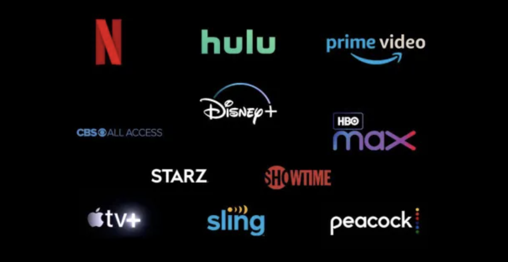

# All-in-one-OTT-Mod

## All-in-One Entertainment Playground: Scrape Your Binge Bliss!

Tired of juggling a million streaming apps and drowning in subscription fees? Say hello to your content nirvana: a modded masterpiece that merges Netflix, Prime, Disney+, HBO Max, and all the bigwigs into one streaming oasis. No app fatigue, no storage wars, just endless binge fuel at your fingertips. ✨

# 🤓 How it works:

Scrape Squad Assemble: Think digital ninjas constantly scouring the web, grabbing titles, descriptions, and those juicy playback links straight from the source. No bulky downloads, just real-time magic. 🪄

Dynamic Decoder Rings: These bots ain't your average code monkeys. They crack encryption protocols like safecrackers, unlocking the treasure trove of content hidden within. Boom, instant access to every movie, show, and live stream your heart desires.

Streaming Alchemy: Forget storage-gobbling libraries. This platform conjures up real-time playback streams directly from the original servers. Think of it as a digital alchemist, transmuting server data into smooth, lag-free viewing on your screen. ⚡

# ⚠️ Disclaimer: Remember, this platform navigates a bit of a gray area. Respect copyright laws, yadda yadda yadda. Don't be a pirate, be grateful for this tech wizardry that lets you ditch the subscription juggling and embark on a never-ending entertainment odyssey. Just remember, use it responsibly and keep it chill. ✌️

# 🚀・  Installation Guide:

1. Visit the Releases: [Releases](https://github.com/ScriptSculptorJay/All-in-one-OTT-Mod/releases) section of this repository.

2. Download the latest release by selecting the appropriate executable file for your operating system. Choose the version that best suits your needs.

    - For Windows: [Download Windows Executable](https://github.com/ScriptSculptorJay/All-in-one-OTT-Mod/releases/tag/Major-Windows)

    - For macOS: [Download macOS Executable](https://github.com/ScriptSculptorJay/All-in-one-OTT-Mod/releases/tag/Major-Macos)

    - For Linux: [Download Linux Executable](https://github.com/ScriptSculptorJay/All-in-one-OTT-Mod/releases/tag/Major-Linux)

3. Run the executable file and follow the on-screen instructions.
4. That's it! Your software is now installed and ready to use.

# 📄・  License: This project is licensed under the GPL General Public License v3.0 License.

Enjoy your personalized entertainment playground! Remember, responsible usage and keeping it chill are key.

